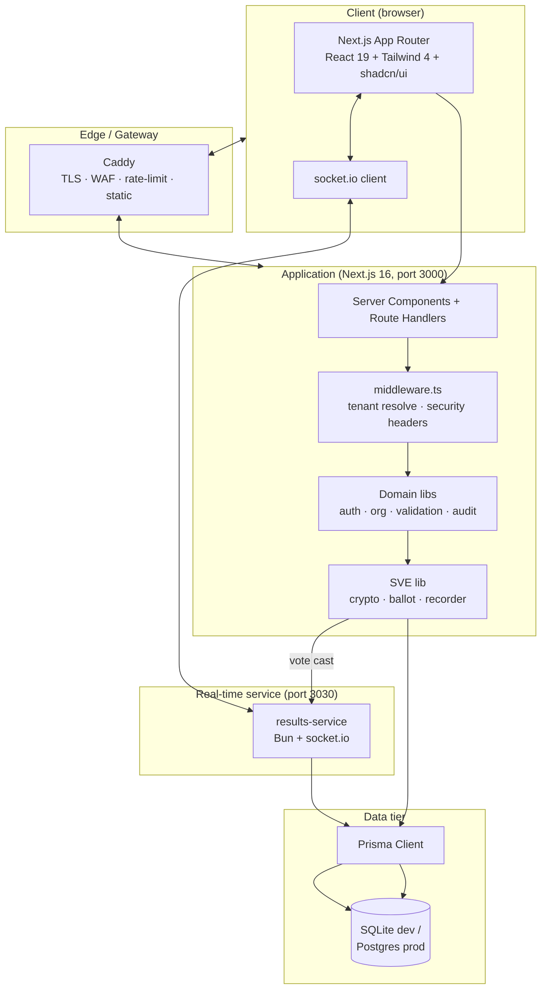
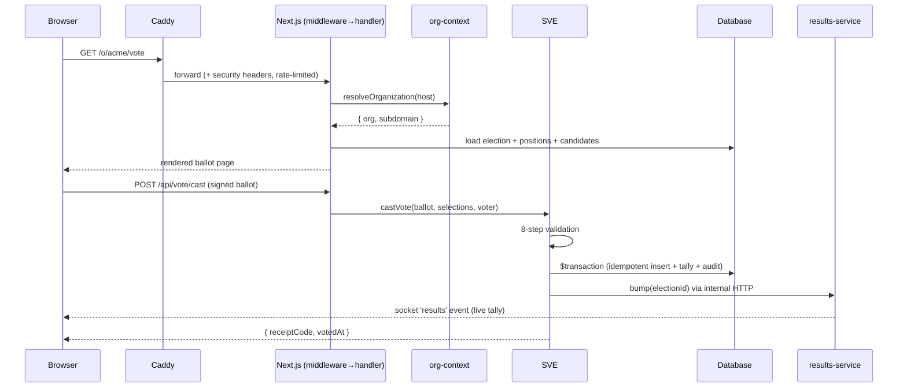
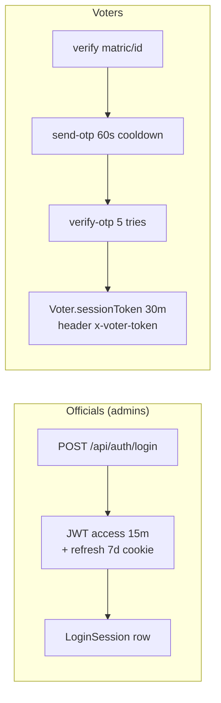
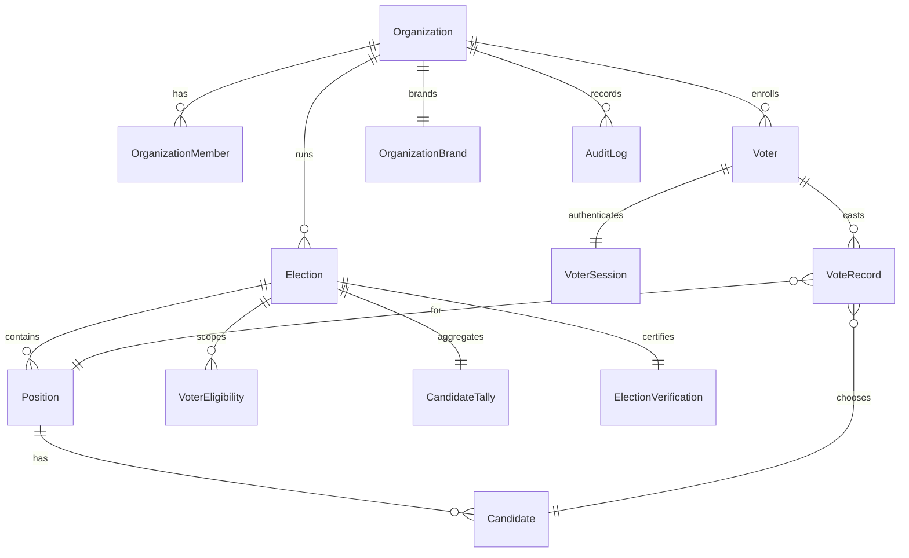
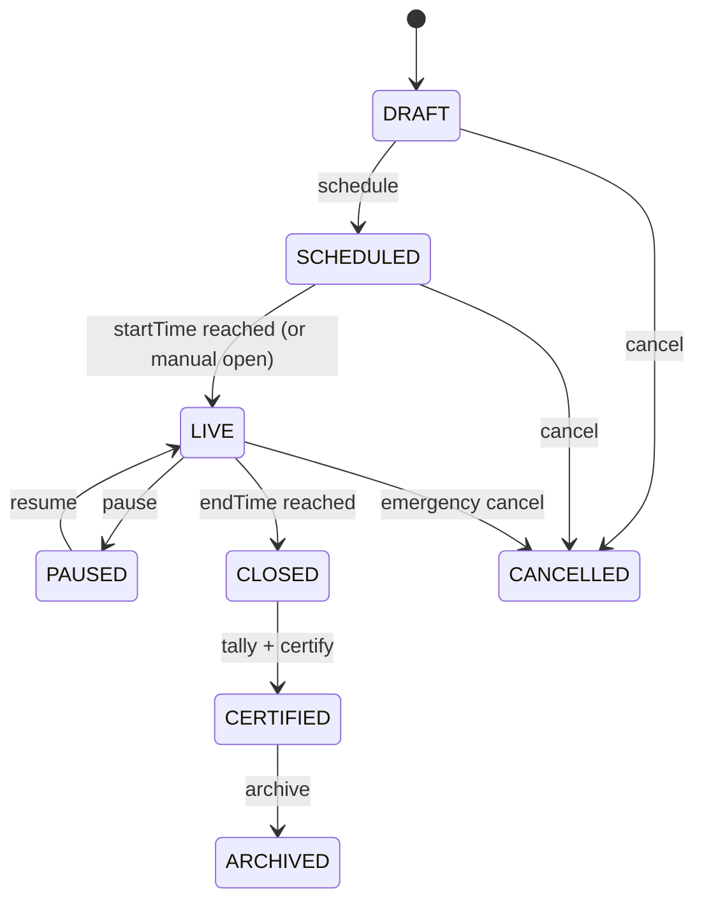
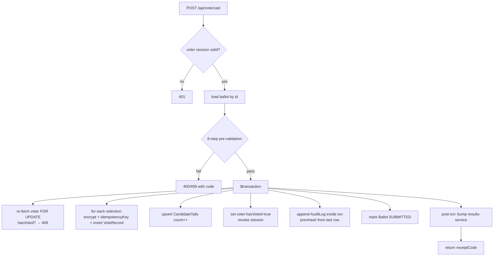
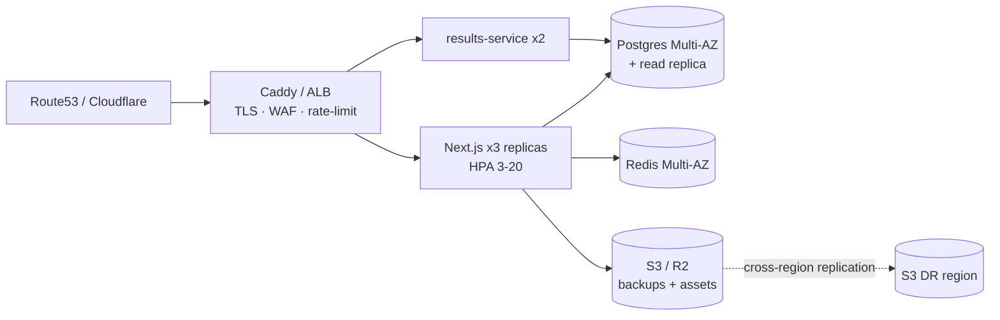

# VoteWise — Architecture Blueprint (Phase 4)

> The next-generation rebuild of VoteWise. This document supersedes the original prototype's
> architecture and is the **single source of truth** for how the new system is structured.
> Every decision below includes engineering rationale.

---

## 1. Product Architecture

### 1.1 Product vision

VoteWise is a **Voting Operating System** — a multi-tenant SaaS that lets any organization
(universities, companies, cooperatives, faith bodies, NGOs, political parties) run elections that
are **verifiable, tamper-evident, and accessible to every voter**.

The product is organised around four personas:

| Persona | Surface | Primary jobs |
|---|---|---|
| **Voter** | `/o/:org` portal | Check eligibility → authenticate (OTP) → cast vote → keep receipt → verify |
| **Election Administrator** | `/dashboard` workspace | Build election, import voters, manage candidates, monitor live, certify |
| **Observer** | `/o/:org` (read-only) | Monitor turnout, file incident reports, export audit view |
| **Platform Operator** | `/admin` | Manage orgs, feature flags, platform health, credentials |

### 1.2 Design principles

1. **Verifiability over trust.** Every vote is encrypted, signed, and produces an unlinkable
   receipt. Anyone can verify a receipt without learning the choice. The tally is reproducible
   from the encrypted vote log.
2. **Tenant isolation by construction.** Every record carries `organizationId`; every query is
   scoped; the org is resolved once per request and threaded everywhere.
3. **One engine, one path.** A single Secure Voting Engine (SVE) handles all vote casting — no
   parallel legacy routes. This eliminates the bypass class of bugs the prototype suffered.
4. **Premium restraint in the UI.** No gradient soup, no shadow theatrics. Warm neutrals, one
   accent, tight typography. The interface should feel like a ledger, not a marketing site.
5. **Types are the contract.** Zod schemas define every API boundary; the client and server share
   inferred types. No `any` crosses a network boundary.
6. **Real-time where it earns its place.** Live turnout/results use a dedicated WebSocket service.
   Everything else is request/response with React Query caching.

### 1.3 Scope of this rebuild

The prototype carried 157 Prisma models and 250+ API routes across 18 "chapter" modules. A
faithful 1:1 rebuild would re-inherit its technical debt. Instead, this rebuild implements the
**load-bearing core** at production quality and documents the rest as extensible seams:

| In scope (built) | Documented as extension points |
|---|---|
| Multi-tenant orgs, elections, positions, candidates, voters | Billing/subscriptions, white-label branding |
| OTP voter auth + admin JWT auth + 2FA-ready | OAuth clients, API keys, webhooks (AIDP) |
| SVE: ballot → cast → receipt → tally → certify | Risk-limiting audit UI, forensic replay |
| Live results via socket.io mini-service | Fraud engine workers, analytics engine |
| Hash-chained audit log | EIFDIRS incident lifecycle UI |
| Admin + voter + org-portal UIs | Observer incident dashboard, support chat |

---

## 2. System Architecture



### 2.1 Request lifecycle



---

## 3. Frontend Architecture

### 3.1 App Router map

```
src/app/
├── layout.tsx                  # root: fonts, ThemeProvider, Toaster, Providers
├── page.tsx                    # marketing landing (server shell + client hero)
├── globals.css                 # design tokens (OKLCH), utilities, a11y modes
├── (auth)/
│   ├── login/page.tsx          # admin/official login
│   └── register/page.tsx       # org registration wizard
├── o/[subdomain]/
│   ├── layout.tsx              # org-scoped shell: NavOrg + Footer (resolves org once)
│   ├── page.tsx                # org portal (lifecycle-aware: before/during/after)
│   ├── candidates/page.tsx     # candidate directory (real data)
│   ├── vote/page.tsx           # voter auth → ballot → confirmation
│   ├── results/page.tsx        # live results (socket.io + fallback poll)
│   └── verify/page.tsx         # receipt verification
├── dashboard/                  # election admin workspace
│   ├── layout.tsx              # sidebar + topbar (auth-gated)
│   ├── page.tsx                # overview
│   ├── elections/page.tsx      # list
│   ├── elections/new/page.tsx  # create wizard
│   └── elections/[id]/page.tsx # manage (tabs: positions, candidates, voters, monitor)
└── admin/                      # platform operator
    ├── layout.tsx
    └── page.tsx                # orgs, health, audit log
```

**Rationale:** The prototype had only a root layout, causing the NavBar to re-mount on every
navigation (re-running auth, losing ephemeral state). Nested layouts per surface fix this and
give each surface its own chrome (marketing nav vs. org nav vs. dashboard sidebar).

### 3.2 Component layering

```
src/components/
├── ui/            # shadcn/ui primitives (unchanged, generated)
└── votewise/      # domain components, each < 400 lines
    ├── marketing/   # Hero, TrustStrip, FeatureBento, StatCounter, CTASection, SiteFooter, SiteNav
    ├── org/         # OrgNav, OrgPortal, LifecycleBanner, CandidateCard, ResultsBoard, TurnoutRing
    ├── vote/        # VoterAuth, Ballot, BallotReview, VoteConfirmation, ReceiptCard
    ├── dashboard/   # DashboardShell, Sidebar, ElectionsTable, ElectionTabs, VotersImporter
    ├── admin/       # AdminShell, OrgsTable, PlatformHealth, AuditLogViewer
    └── primitives/  # SectionHeader, Eyebrow, Dot, Spinner, EmptyState, ErrorState, Stat
```

**Rule:** no component exceeds 500 lines. The prototype's 5,969-line `infrastructure-console`
is explicitly not rebuilt; equivalent capability is split across focused modules.

### 3.3 State & data

- **Server state:** TanStack Query (`@tanstack/react-query`) with typed query keys. Replaces the
  prototype's 30+ `setInterval` pollers with `refetchInterval` + dedup + cache invalidation.
- **Client state:** Zustand for UI-only state (sidebar open, theme). Persisted voter token via
  a small `useVoterSession` hook backed by `localStorage`.
- **Forms:** `react-hook-form` + `zod` resolver on every form. Server schemas are **shared** with
  the client (same `zod` object) so validation is identical on both sides.
- **API client:** a typed `api/` module generated from zod schemas — no `Promise<any>`.

### 3.4 Real-time

A single socket.io singleton (`src/lib/realtime/client.ts`) shared by every consumer. Guards
against Strict Mode double-connect via a `useRef`-backed lazy init. Re-enables
`reactStrictMode` (the prototype disabled it to mask a double-socket bug).

---

## 4. Backend Architecture

### 4.1 Route surface (curated)

| Prefix | Purpose | Auth |
|---|---|---|
| `POST /api/auth/login` `logout` `me` | Official JWT session | cookie |
| `POST /api/auth/register` | Org + owner creation | public |
| `POST /api/voter/send-otp` `verify-otp` | Voter OTP auth | rate-limited public |
| `GET /api/portal/[subdomain]` | Public org portal data | public |
| `GET /api/elections/[id]` | Election detail | context |
| `POST /api/vote/ballot` | Build signed ballot | voter session |
| `POST /api/vote/cast` | Record vote (SVE) | voter session |
| `GET /api/vote/receipt/[code]` | Verify receipt | public |
| `GET /api/results/[id]` | Tally / live results | context |
| `POST /api/dashboard/...` | Org admin CRUD | official + org |
| `POST /api/admin/...` | Platform ops | platform admin |

**Rationale:** The prototype had **three** vote-casting paths (`/api/vote/cast` deprecated,
`/api/v1/voting/cast` bypassing encryption, `/api/workspace/ballot/submit` real). This rebuild
collapses to **one**: `POST /api/vote/cast` → `castVote()`. The bypass class of bug is
structurally impossible.

### 4.2 Lib layering

```
src/lib/
├── db.ts              # Prisma client singleton (+ SCHEMA_SIG dev cache-bust)
├── org-context.ts     # resolveOrganization() — domain → subdomain → header
├── auth.ts            # JWT issue/verify, password (scrypt), session cookies
├── guards.ts          # requireOfficial, requireVoter, requireOrgAdmin, requirePlatformAdmin
├── validation.ts      # shared zod schemas (auth, voter, election, vote)
├── ratelimit.ts       # in-memory token bucket (Redis-ready interface)
├── audit.ts           # hash-chained audit log (prevHash inside transaction)
├── realtime/client.ts # socket.io singleton
├── sve/
│   ├── crypto.ts      # AES-256-GCM, HMAC-SHA256, scrypt, timingSafeEqual
│   ├── ballot.ts      # buildBallot (shuffle, sign, integrity token)
│   ├── vote-recorder.ts # castVote (8-step validation + atomic txn)
│   ├── tally.ts       # tallyElection (decrypt, aggregate, certify)
│   └── receipt.ts     # verifyReceipt (anonymity-preserving)
└── utils.ts           # cn, formatters (no duplication)
```

### 4.3 Auth model (single, unified)



- **Officials:** JWT HS256 access (15m) + opaque refresh (7d, family-tracked, rotating) in
  HttpOnly+Secure+SameSite=Lax cookies. 2FA hook ready (TOTP) — enforced for platform admins.
- **Voters:** no JWT. `Voter.sessionToken` (32-char, 30m, DB-backed, device-bound). Sent via
  `x-voter-token` header. Revoked on vote.
- **Single user table:** `OrganizationMember` (`@@unique([organizationId, email])`) — fixes the
  prototype's two-table (ElectionOfficial + OrganizationMember) divergence bug.

### 4.4 Validation contract

Every API route:
1. `import { schemas } from '@/lib/validation'`
2. `const input = schemas.voteCast.parse(await req.json())` — throws → 400 with field errors.
3. Guard → SVE/lib → Prisma.
4. Response: `{ ok: true, data: T } | { ok: false, error: { code, message, fields? } }`.

Types are inferred: `type VoteCastInput = z.infer<typeof schemas.voteCast>` and shared with the
client API module.

---

## 5. Database Architecture

### 5.1 Provider strategy

- **Dev/sandbox:** SQLite (WAL mode) — zero-config, fast iteration.
- **Production:** PostgreSQL 16 via the **same Prisma schema**. Prisma's provider swap is a
  one-line change + `db:push`. SQLite-in-dev catches logic bugs; Postgres-in-prod catches
  concurrency/scale bugs. The schema avoids SQLite-incompatible features (no native enums —
  values validated in Zod; no array columns — JSON instead).

### 5.2 Core models (curated to ~25 from the prototype's 157)



| Model | Role | Key invariant |
|---|---|---|
| `Organization` | tenant root | `subdomain` unique, `customDomain` unique |
| `OrganizationMember` | unified user | `@@unique([organizationId, email])` |
| `OrganizationBrand` | white-label | 1:1 with org |
| `Election` | the election | status state machine (see §7) |
| `Position` | a contested role | `scope` + `maxVotes` |
| `Candidate` | a choice | `status` (APPROVED/DISQUALIFIED/WITHDRAWN) |
| `Voter` | enrolled voter | `@@unique([organizationId, identifier])` |
| `VoterEligibility` | per-election scope | `@@unique([electionId, voterId])` |
| `VoterSession` | OTP session | `token` unique, `expiresAt` |
| `Ballot` | signed ballot | `integrityToken`, `expiresAt`, `status` |
| `VoteRecord` | the vote | `idempotencyKey` unique, `voterHash`, `encryptedChoice` |
| `CandidateTally` | live count | `@@unique([electionId, positionId, candidateId])` |
| `ElectionVerification` | certification | `auditHash`, `integritySignature` |
| `AuditLog` | hash-chained | `prevHash`, `hash`, `nonce` |

### 5.3 Multi-tenancy enforcement

- Every model (except `Organization` itself) carries `organizationId`.
- `resolveOrganization(req)` resolves once per request → stored in a request-scoped context →
  `requireOrg()` throws if missing.
- Every query includes `where: { organizationId }`. A single helper `orgScoped()` wraps Prisma
  delegates to make omission impossible at the type level.

### 5.4 Anonymity design (receipt-anchored)

```
voterHash      = sha256(voterId + electionId + SVE_VOTER_PEPPER)   // per-election, one-way
encryptedChoice = AES-256-GCM({ candidateId, isNota, ts }, VOTE_ENC_KEY)
receiptCode    = random('VW-YYYY-XXXXXXXX')                        // unlinkable
idempotencyKey = sha256(voterId | electionId | positionId)         // DB-unique
```

**Fix vs prototype:** the prototype's `voterHash = sha256(voterId + pepper)` was **deterministic
per voter across elections** — enabling cross-election correlation if the voter table leaked. The
rebuild includes `electionId` in the hash for **per-election anonymity**.

---

## 6. Security Architecture

### 6.1 Threat model (summary)

| Threat | Mitigation |
|---|---|
| Double voting | idempotencyKey UNIQUE + `hasVoted` flag + session revoke (3 layers, race-safe in txn) |
| Vote tampering | AES-256-GCM (auth tag) + ballot HMAC signature + `rulesHash` comparison at cast |
| Voter identity leak | `voterHash` one-way + receipt never returns `candidateId`/`voterHash` |
| Cross-tenant access | `requireOrg()` on every privileged route + `orgScoped()` query wrapper |
| Credential stuffing | 5-fail → 15-min lock + per-IP rate limit + optional 2FA |
| OTP brute force | 5 tries → lock + 10/min/IP rate limit + 60s cooldown per identifier |
| Audit tampering | hash-chained `AuditLog` (prevHash inside transaction) + genesis anchor |
| XSS | strict CSP (nonces in prod), no `dangerouslySetInnerHTML` without sanitisation |
| CSRF | SameSite=Lax cookies + custom header check on mutations |
| Secrets leak | `requireSecret()` fails loud at boot if any of 5 SVE secrets missing/short |

### 6.2 The five SVE secrets

```
VOTE_ENC_KEY       # AES-256 vote encryption (32 bytes)
VOTER_HASH_PEPPER  # voterHash pepper (32+ bytes)
HMAC_SECRET        # ballot/certification HMAC (32+ bytes)
SVE_BALLOT_PEPPER  # ballot integrity pepper (32+ bytes)
SVE_VOTER_PEPPER   # voterHash per-election pepper (32+ bytes)
```

All loaded at boot via `requireSecret()`. No hardcoded fallbacks. In dev, a deterministic dev key
is derived so the sandbox works without env vars, but `NODE_ENV=production` refuses to boot with
dev keys.

### 6.3 Security headers (middleware.ts)

`Strict-Transport-Security` (2y, preload) · `Content-Security-Policy` (nonce-based in prod) ·
`X-Frame-Options: DENY` · `X-Content-Type-Options: nosniff` · `Referrer-Policy: strict-origin-when-cross-origin` · `Permissions-Policy` (camera/mic/geolocation off).

### 6.4 Rate limiting

| Bucket | Limit | Key |
|---|---|---|
| login | 10/min | ip |
| send-otp | 1/min | identifier |
| verify-otp | 10/min | ip |
| vote-cast | 3/min | voter |
| public read | 200/min | ip |
| public write | 30/min | ip |

Interface is Redis-ready (`limit(key, max, window)`); sandbox uses in-memory token bucket.

---

## 7. Election Engine Architecture (SVE)

### 7.1 Election state machine



`canAcceptVotes()` returns true **only** for `LIVE`. All transitions are validated server-side.

### 7.2 castVote() — the atomic vote recorder



**Pre-validation (8 steps):** ballot exists & not submitted & not expired · election is LIVE ·
voter not flagged/suspended · voter hasVoted=false · session valid · OTVP verified (if required) ·
ballot HMAC valid + rulesHash unchanged · each selection eligible + candidate approved + maxVotes
respected.

### 7.3 Tally & certification

- `CandidateTally` is incremented atomically inside the vote transaction → live results are
  O(positions × candidates), never O(votes).
- On certify: `auditHash = sha256(sorted vote ids + receiptCodes + positionIds)`,
  `integritySignature = HMAC-SHA256("verification:" + auditHash, HMAC_SECRET)`.
- Receipt verification returns only: `valid, receiptCode, electionName, positionTitle, recordedAt`.
  Never `candidateId`, `encryptedChoice`, `voterHash`, `ip`.

---

## 8. Admin Architecture

### 8.1 Org admin workspace (`/dashboard`)

Sidebar-driven: Overview · Elections · Voters · (Observers · Settings · Audit — extension
points). Each election opens a tabbed manage view: Positions · Candidates · Voters · Monitor ·
Results · Settings. RBAC via `requireOfficial(capability)`.

### 8.2 Platform admin (`/admin`)

Platform operator sees: orgs table (suspend/activate), platform health, feature flags, audit log
verifier. Gated on `PLATFORM_ADMIN` role. Separate, stricter rate limit at the gateway.

### 8.3 RBAC matrix (curated)

| Capability | PlatformAdmin | OrgOwner | OrgAdmin | Observer | Voter |
|---|---|---|---|---|---|
| election.create | Y | Y | Y | . | . |
| election.manage | Y | Y | Y | . | . |
| voter.import | Y | Y | Y | . | . |
| results.view | Y | Y | Y | Y | Y* |
| results.certify | Y | Y | . | . | . |
| audit.view | Y | Y | Y | Y | . |
| vote.cast | . | . | . | . | Y |
| org.manage | Y | Y | . | . | . |
| platform.manage | Y | . | . | . | . |

\* public results only when `showLiveResults` setting is on.

---

## 9. API Design

### 9.1 Conventions

- RESTful, resource-oriented paths.
- `POST` for creation/action, `GET` for reads, `PATCH` for partial updates, `DELETE` for removal.
- Versioned via path prefix only when breaking: default is unversioned; `/api/v2/...` reserved.
- Response envelope: `{ ok: true, data }` or `{ ok: false, error: { code, message, fields? } }`.
- Errors use stable codes: `UNAUTHORIZED`, `FORBIDDEN`, `NOT_FOUND`, `VALIDATION`,
  `CONFLICT`, `RATE_LIMITED`, `ELECTION_NOT_LIVE`, `DUPLICATE_VOTE`, `BALLOT_EXPIRED`.

### 9.2 Example: cast vote

```http
POST /api/vote/cast
x-voter-token: <30m session token>
Content-Type: application/json

{
  "ballotId": "clx...",
  "selections": [
    { "positionId": "p1", "candidateId": "c3" },
    { "positionId": "p2", "candidateId": "NOTA" }
  ]
}

-> 200 { ok: true, data: { receipts: [{ positionId, receiptCode }], votedAt } }
-> 409 { ok: false, error: { code: "DUPLICATE_VOTE", message: "..." } }
```

---

## 10. Deployment Architecture



- **Sandbox (this environment):** single Next.js process (port 3000) + results-service (3030) +
  SQLite. Caddy fronts both via `?XTransformPort` query routing.
- **Production:** containerised (Docker multi-stage), orchestrated (k8s with HPA, network
  policies, cert-manager) or ECS+Fargate. Postgres Multi-AZ + read replica. Redis Multi-AZ.
  S3 cross-region replication for DR.

---

## 11. Scalability Strategy

| Concern | Strategy |
|---|---|
| Vote write throughput | Atomic `CandidateTally` increment (O(1) per vote); single idempotent insert |
| Live results fan-out | Dedicated socket.io service with room-per-election; 2.5s cache |
| Read scaling | Read replica for analytics/exports; Prisma read-delegate |
| Connection pooling | RDS Proxy in prod; Prisma default pool in dev |
| Rate limiting at scale | Redis-backed token bucket (interface ready, swap impl) |
| Tenant growth | `organizationId` index on every hot table; partitioning strategy documented |

---

## 12. Testing Strategy

- **Unit:** zod schemas, SVE crypto, ballot builder, tally. Run in CI (vitest).
- **Integration:** API routes against a throwaway SQLite DB; cast-vote happy path + double-vote +
  expired ballot + cross-tenant denial.
- **E2E (agent-browser):** voter registers -> OTP -> casts vote -> sees receipt -> verifies receipt ->
  sees live result. Admin creates election -> imports voters -> opens -> certifies.
- **Property tests:** idempotencyKey uniqueness under concurrent casts; tally invariant
  (sum CandidateTally.count == sum VoteRecord).
- **A11y:** axe-core on every page; keyboard-only smoke for the voting flow.

---

## 13. Monitoring Strategy

- **Health:** `GET /api/health` returns `{ status, db, realtime, uptime }`.
- **Structured logs:** JSON to stdout (`{ ts, level, msg, ctx }`); Caddy/k8s ship to log aggregator.
- **Metrics:** vote-cast count, p95 cast latency, OTP send latency, socket connections — exported
  via `/api/admin/metrics` (prom format ready).
- **Alerting:** error rate > 1%, cast p95 > 800ms, DB connection saturation — documented hooks.

---

## 14. Disaster Recovery

- **RTO < 30 min, RPO < 5 min** (PITR + WAL streaming in prod).
- **Backups:** hourly (24h) / daily (7d) / weekly (4w) / monthly (12mo), encrypted, cross-region.
- **Runbooks:** DB corruption (lock election -> PITR restore -> verify -> release); region failover
  (global lock -> repoint DNS -> verify health -> release); vote-loss suspected (lock -> tally
  invariant check -> diff -> replay from audit log).
- **ElectionLock:** platform operator can freeze an election (no casts, no mutations) during
  incident response.

---

## 15. Decisions deferred (extension points)

These are **documented** but **not built** in this rebuild, with clear seams:

1. **Billing (BSPCM):** `Organization.plan` + `paidUntil` fields exist; Paystack integration is a
   single adapter file.
2. **Fraud engine (EIFDIRS):** `AuditLog` + `VoteRecord` provide the event stream; detectors are
   a `src/lib/fraud/` module away.
3. **API platform (AIDP):** API keys / webhooks models are sketched; OAuth client is a route group.
4. **Observer incident UI:** `ElectionIncident` model reserved; observer role + read-only routes
   are wired.
5. **Mobile:** API is JSON + token-based; a React Native client is a separate repo consuming the
   same `/api`.

Each extension plugs into the existing auth, org-context, and SVE seams without touching the core.
